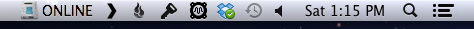
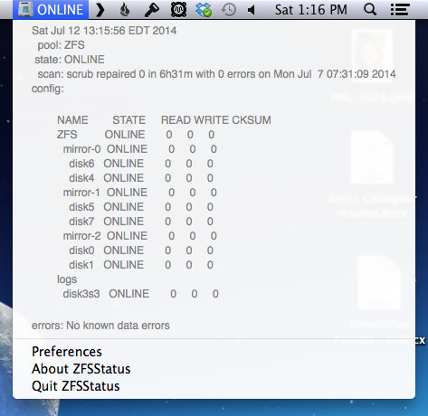

ZFSStatus
=========

Menu bar app to provide ZFS zpool status. Preferences allow you to set the pool name, and the refresh interval for the status in the menu bar. The status view in the menu pane refreshes on every click.

Closed view:

Opened view:

